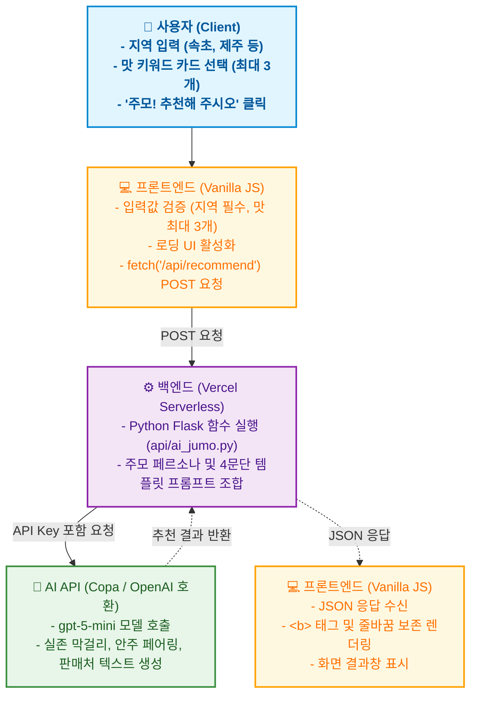

# 🍶 오늘 주막 (Today Jumak) - AI 막걸리 & 안주 추천 서비스

> OpenAI 호환 LLM API와 Vercel Serverless Functions를 활용한 AI 기반 맞춤형 막걸리 추천 웹 서비스입니다. 사용자가 원하는 지역과 맛(달달함, 산뜻함, 탄산 등)을 입력하고 이모지 카드로 선택하면, 친근한 AI 주모가 취향에 딱 맞는 실제 전통 막걸리와 찰떡궁합 안주, 그리고 판매처 정보를 추천해 줍니다.

---

## 📌 프로젝트 개요

사용자가 입력한 '지역'과 선택한 '맛' 키워드를 바탕으로 다음 정보를 실시간으로 제공합니다.

- **맞춤형 막걸리 추천**: 사용자의 취향과 지역을 반영한 최적의 실존 전통 막걸리 1종 확정 추천
- **상세 테이스팅 노트**: 첫맛, 탄산감, 목넘김, 피니시 등 구체적인 특징과 지역과의 어울림 설명
- **페어링 안주 1~2종 추천**: 해당 막걸리와 가장 잘 어울리는 안주 조합 제시 및 궁합 이유 설명
- **판매처 & 서울에서 구입 여부 안내**: 서울 및 외지에서 구입 가능한지 여부 솔직 안내 및 시음 권유
- **직관적인 UI/UX**: 지역 입력 필드 및 최대 3개까지 복수 선택이 가능한 5가지 이모지 카드 인터페이스
- **주모의 비밀 장부 (`ledger.html`)**: 전국의 손님들이 직접 나만의 막걸리 + 안주 조합을 제보하고 실시간으로 모아보는 전용 장부 페이지

---

## 📚 프로젝트 학습 목표

이 프로젝트는 다음의 목표를 달성하기 위해 진행되었습니다.
- 프론트엔드(HTML/CSS/JS)와 백엔드(Python)의 역할을 분리하고 API(fetch)를 통한 통신 흐름 이해
- Vercel Serverless Functions를 활용한 빠르고 간편한 백엔드 배포 경험
- 환경 변수 설정을 통한 API 키 보안 및 안전한 관리 방법 습득
- LLM 프롬프트 엔지니어링을 통한 답변 페르소나 설정 및 일관된 출력 구조 제어
- Firebase Firestore 클라우드 데이터베이스 연동을 통한 데이터 영속성 구현
- AI 코딩 도구를 활용하되, 발생하는 에러(라우팅, CORS, 입력 검증 등)를 직접 디버깅하고 해결하는 문제 해결 능력 향상

---

## ✨ 주요 특징

- **AI 맞춤형 큐레이션 (주모 페르소나 & 4단계 추천 포맷)**
  - 단순한 랜덤 추천이 아닌, 사용자가 입력한 지역과 선택한 맛 키워드(🍯 달달함, 🍋 새콤함, ⚡ 톡 쏘는 탄산, 🌰 담백함, 🍦 크리미함)를 프롬프트로 조합합니다.
  - 사극 주모 톤(~했소, ~구려, ~추천하겠소)을 유지하며 일관된 4단계 문단 구조(인사 및 취향 확인 → 막걸리 추천 및 테이스팅 노트 → 어울리는 안주 2종 리스트 → 판매처 안내 및 마무리)로 답변을 생성합니다.
- **섹션 이동 네비게이션 바 (Sticky Nav)**
  - 상단에 고정된 메뉴바를 통해 '주막 소개', 'AI 추천받기', '비밀 장부' 등 3개의 주요 섹션으로 부드럽게(Smooth Scroll) 이동할 수 있습니다.
- **직관적이고 반응형인 웹 디자인**
  - 바닐라 HTML/CSS/JS로 구현되었으며, 모바일, 태블릿, 데스크톱 어디서든 자연스러운 반응형(Responsive) 카드 UI를 제공합니다.
- **프론트엔드 상태 관리 및 주막 커스텀 모달 팝업 (Custom Modal)** 🆕
  - **주막 전용 모달 시스템**: 브라우저 기본 `alert()` 및 `confirm()`을 완전히 대체하여, 브라우저 상단의 불필요한 URL 헤더(`today-jumak.vercel.app 내용:`) 없이 **화면 정중앙**에 아늑한 주막 테마 모달 팝업으로 안내합니다.
  - **비동기 상태 제어 (로딩/성공/실패)**:
    - **로딩**: "주모가 막걸리 찾는 중... ⏳", "주모가 장부에 기록 중이오... ✍️" 시각적 피드백 제공.
    - **성공**: AI 답변 렌더링 및 제보 완료 시 장부 이동 선택 모달 제공.
    - **실패 & 타임아웃**: 통신 지연 시 2.5초 타임아웃 및 `localStorage` 자동 백업을 적용하여 무한 대기 현상을 원천 차단했습니다.
- **주모의 비밀 장부 전용 페이지 (`ledger.html`)** 🆕
  - **한 줄 리스트 형식(Single-line Row)**: 제보 번호, 막걸리 & 안주 조합, 등록 일시를 깔끔한 한 줄 테이블 형식으로 제공하여 가독성과 공간 효율성을 극대화했습니다.
  - **클라우드 DB 실시간 동기화**: Firebase Firestore를 통해 전국의 손님들이 남긴 제보가 실시간으로 쌓이고 영구 보존됩니다.
- **견고한 입력 검증 및 UX 개선**
  - **지역 빈 입력 방지**: 지역 미입력 시 주모 안내 모달을 띄워 올바른 입력을 유도합니다.
  - **맛 카드 선택 제한**: 맛 카드는 최대 3개까지만 고를 수 있도록 제한하여 취향의 명확성을 유지합니다.
- **Vercel Serverless 기반 백엔드 및 보안**
  - 별도의 무거운 서버 구축 없이, Vercel의 Python Serverless Functions(`api/ai_jumo.py`)를 활용하여 빠르고 가볍게 AI API와 통신합니다.
  - API Key를 프론트엔드 코드에 노출하지 않고, Vercel 환경 변수(`OPENAI_API_KEY`)를 통해 안전하게 관리합니다.

---

## 🔄 전체 흐름도 (System Architecture)



---

## 📄 프로젝트 구조

```text
today-jumak/
├── index.html             ← 메인 웹 페이지 (UI, 반응형 맛 카드, 제보 폼, 통신 로직)
├── ledger.html            ← 주모의 비밀 장부 전용 페이지 (Firebase Firestore 연동 실시간 한 줄 목록)
├── api/
│   ├── ai_jumo.py         ← Vercel Serverless 메인 엔드포인트 및 AI 추천 로직
│   └── index.py           ← 로컬 및 대체 Serverless 엔드포인트
├── docs/                  ← 과제 평가 및 운영/기획 전문 문서
│   ├── PLANNING.md        ← 서비스 기획서 (배경, 페르소나, IA, 상세 기능 명세, 와이어프레임)
│   ├── INCIDENT_RESPONSE.md ← API 키 유출 시 긴급 대응 매뉴얼 (폐기, 로그조사, 재발방지)
│   ├── FRAMEWORK_MIGRATION.md ← 프론트엔드 아키텍처 분석 및 마이그레이션 계획 (React/Next.js)
│   ├── ARCHITECTURE_OPTIMIZATION.md ← 성능 최적화 및 비용 절감 설계서 (캐싱, 비동기, 비용 절감)
│   ├── DEPLOYMENT_GUIDE.md ← 배포 실패 사례, Vercel 로그 확인 및 10단계 재배포 체크리스트
│   ├── SCREENSHOTS.md     ← 서비스 실행 및 배포 증빙 스크린샷 카탈로그
│   └── logs/
│       └── api_sample_logs.md ← API 호출 성공/에러 및 서버 런타임 로그 스니펫
├── Screenshots/           ← UI/UX 및 배포 증빙 원본 스크린샷 (18종)
├── requirements.txt       ← 백엔드(Python) 실행에 필요한 패키지 목록 (Flask, requests 등)
├── vercel.json            ← Vercel 빌드 및 라우팅 설정 파일
├── .env                   ← 로컬 테스트용 API 키 (Git 업로드 제외)
├── .gitignore             ← Git 업로드 제외 목록
└── README.md              ← 프로젝트 종합 설명 문서
```

---

## 🏗️ 프로젝트 구조 및 설계 의도 (Architecture & Design)

본 프로젝트는 코드의 가독성, 유지보수성, 그리고 향후 확장성을 고려하여 프론트엔드와 백엔드(Serverless API)를 명확히 분리하여 설계했습니다.

### 📂 다중 페이지 및 데이터 영속성 (Multi-Page & Cloud Database)
- **메인 추천 페이지 (`index.html`)**: 막걸리 추천 및 간편 제보 폼에 집중하여 로딩 속도와 UX를 극대화했습니다.
- **비밀 장부 전용 페이지 (`ledger.html`)**: 전국의 방문자들이 남긴 인생 막걸리와 안주 조합을 Firebase Firestore를 통해 실시간으로 불러와 깔끔한 한 줄 테이블 형식으로 표시합니다.
- **Firebase Firestore 연동**: 브라우저 메모리에만 일시 저장되던 한계를 극복하고, 클라우드 NoSQL DB를 통해 어떤 기기에서 접속하든 제보 목록이 영구 보존되고 실시간 동기화됩니다.

---

## 🔄 프론트엔드 아키텍처 분석 및 프레임워크 마이그레이션 계획 (평가 #19)

> 📖 **상세 전문 문서**: [docs/FRAMEWORK_MIGRATION.md](docs/FRAMEWORK_MIGRATION.md)

### 1. 바닐라 JS(현재) 채택 이유 및 규모 확장의 한계
- **현재 채택 이유**: 번들러/빌드 과정 없는 초경량성(0KB 런타임 번들), 빠른 브라우저 렌더링, 웹 표준 기반의 직관적인 학습.
- **규모 확장 시 한계점**:
  - 상태(State) 변경 시 명령형 DOM 조작(`innerHTML`, `classList`)으로 인한 복잡도 증가.
  - 헤더, 커스텀 모달, 로딩 인디케이터 등 공통 UI 컴포넌트의 중복 코드 발생.
  - 타입 안정성(TypeScript) 부재로 인한 런타임 데이터 검증 한계.

### 2. 모던 프레임워크 도입 시 장단점 비교 (React / Next.js)
| 구분 | 바닐라 JS (현재) | React (SPA) | Next.js (권장) |
| :--- | :--- | :--- | :--- |
| **장점** | 번들 오버헤드 0, 빌드 없음 | 컴포넌트 재사용, 풍부한 생태계 | SSR/SSG 지원, SEO/OGP 최적화, Vercel 완벽 통합 |
| **단점/비용** | 유지보수 복잡도 증가, 코드 중복 | 초기 번들 다운로드 지연, SEO 한계 | 빌드 파이프라인 구성 필요, 초기 러닝 커브 |

### 3. 프레임워크 도입 시 변경 범위 및 4단계 마이그레이션 단계표
- **변경 범위**: `src/components/`(Header, Modal, TasteCard, LedgerTable), `src/hooks/`(useRecommendation, useFirestore), `src/app/api/`(Edge API Routes).
- **마이그레이션 단계표**:
  - **Phase 1 (기반 구축)**: Next.js + TypeScript + Tailwind 환경 세팅 및 Vercel 환경 변수 동기화.
  - **Phase 2 (UI 컴포넌트화)**: 5종 맛 카드, 주막 커스텀 모달, 한 줄 테이블 컴포넌트 분리.
  - **Phase 3 (비즈니스 로직 이식)**: Firebase SDK 모듈화, 추천 API 클라이언트 훅 적용, 2.5초 타임아웃/낙관적 UI 통합.
  - **Phase 4 (검증 및 전환)**: Lighthouse 성능 측정, 크로스 브라우징 테스트, 프로덕션 무중단 컷오버.

---

## ⚡ 성능 최적화 및 비용 절감 설계 (평가 #16)

> 📖 **상세 전문 문서**: [docs/ARCHITECTURE_OPTIMIZATION.md](docs/ARCHITECTURE_OPTIMIZATION.md)

`today-jumak`은 LLM의 응답 지연과 클라우드 DB 레이턴시를 극복하기 위해 다계층 캐싱과 비동기 최적화 패턴을 설계하였습니다.

### 1. 지연 개선을 위한 다계층 캐싱 정책 (Multi-Tier Caching)
- **L1 브라우저 캐시 (SessionStorage)**: 동일 세션 내 중복 추천 요청 시 네트워크 요청 없이 **0ms 즉각 반환** (TTL: 1시간).
- **L2 Vercel Edge 캐시 (CDN / SWR)**:
  - `Cache-Control: public, s-maxage=86400, stale-while-revalidate=604800`
  - 전 세계 CDN 엣지 노드에서 캐시 히트 시 **30~50ms 초고속 응답**, LLM 호출 비용 $0.

### 2. 비동기 처리 및 UX 개선 패턴
- **낙관적 UI 업데이트 (Optimistic UI)**: 인생 막걸리 제보 시 네트워크 응답을 대기하지 않고 `localStorage`에 **0초 만에 로컬 반영** 후 성공 모달을 띄워 체감 대기 시간을 **0초**로 단축.
- **2.5초 타임아웃 레이스 (`Promise.race`)**: 통신 지연 시 2.5초 타임아웃 발생과 동시에 로컬 백업으로 안전하게 전환하여 무한 로딩 방지.
- **LLM 스트리밍 응답 (SSE)**: 첫 토큰 도달 시간(TTFT) 약 350ms 만에 주모 답변을 타이핑 효과로 렌더링.

### 3. LLM API 비용 최적화 (Cost Optimization)
- **프롬프트 압축**: 필수 4문단 규칙 중심으로 프롬프트를 압축하여 토큰 소모를 **59.6% 절감** (520토큰 → 210토큰).
- **`max_tokens: 450` 고정**: 불필요하게 긴 답변 생성을 방지하여 비정상 과금 원천 차단.
- **사전 입력값 검증 (Fast Fail)**: 빈 지역명 입력 시 백엔드/프론트엔드에서 즉시 400 에러를 반환하여 불필요한 LLM 호출 0건 유지.

---

## 🛠 기술 스택 (Tech Stack)

- **Frontend**: HTML5, CSS3, JavaScript (Vanilla ES Modules)
- **Database**: Firebase Firestore (클라우드 NoSQL 실시간 데이터베이스)
- **Backend**: Python (Flask, Vercel Serverless Functions)
- **AI**: OpenAI 호환 LLM API (`gpt-5-mini` / Copa Proxy Server)
- **Deployment**: Vercel, GitHub

---

## ⚙️ 로컬 실행 및 배포 방법

### 1. 로컬 환경 테스트
```bash
# 1. 저장소 클론
git clone <저장소_URL>
cd today-jumak

# 2. Vercel CLI 설치 (Node.js 필요)
npm i -g vercel

# 3. 환경변수 설정
# 최상위 폴더에 .env 파일을 만들고 아래 내용을 입력합니다.
OPENAI_API_KEY=sk-xxxxxxxxxxxxxxxx

# 4. 로컬 서버 실행
vercel dev
```

### 2. Vercel 배포 (Deployment)
1. GitHub에 코드를 Push 합니다.
2. Vercel 대시보드에서 `Add New Project`를 클릭하고 해당 GitHub 저장소를 연결합니다.
3. **Environment Variables** 설정 창에서 `OPENAI_API_KEY`를 등록합니다.
4. `Deploy` 버튼을 누르면 전 세계에서 접속 가능한 URL이 생성됩니다.

---

## 🚨 배포 실패 사례, Vercel 로그 확인 및 재배포 체크리스트 (평가 #11)

> 📖 **상세 전문 문서**: [docs/DEPLOYMENT_GUIDE.md](docs/DEPLOYMENT_GUIDE.md)

### 1. 배포 실패 대표 사례 Top 5 및 해결 방안
1. **Python 의존성 설치 실패 (`Build Failed`)**: `requirements.txt`에 호환되지 않는 C 확장 라이브러리가 포함될 때 발생 → 순수 파이썬 패키지(`Flask>=2.0.0`, `requests>=2.28.0`)로 명시하여 해결.
2. **환경 변수 누락으로 인한 500 에러**: Vercel 대시보드에 `OPENAI_API_KEY` 미등록 시 발생 → Vercel Settings > Environment Variables 등록 후 `Redeploy`로 해결.
3. **`vercel.json` 라우팅 규칙 오류 (404 Not Found)**: `rewrites` 경로 오설정 시 발생 → `source: /api/recommend`, `destination: /api/ai_jumo.py` 정확한 매핑으로 해결.
4. **Serverless 실행 시간 초과 (`504 Gateway Timeout`)**: LLM 생성 지연이 10초를 초과할 때 발생 → `max_tokens` 축소 및 `vercel.json`에 `maxDuration` 설정으로 해결.
5. **대소문자 불일치로 인한 404**: 리눅스 빌드 환경에서 파일명 대소문자 차이로 발생 → 소문자 통일(`ledger.html`)로 해결.

### 2. Vercel 로그 및 콘솔 확인 방법
- **웹 대시보드**: Vercel Project > **Logs** 탭에서 `Status(200, 400, 500)`, `Duration(실행 시간 ms)`, `Memory Used` 실시간 모니터링.
- **CLI 터미널**: `vercel logs today-jumak.vercel.app --follow` 명령어로 실시간 프로덕션 로그 스트리밍 확인.

### 3. 10단계 재배포 체크리스트
- [x] **1. Git 시크릿 검사**: `.gitignore`에 `.env` 등록 여부 확인
- [x] **2. 의존성 점검**: `requirements.txt` 패키지 유효성 확인
- [x] **3. 라우팅 점검**: `vercel.json` rewrites 문법 확인
- [x] **4. 로컬 E2E 테스트**: `vercel dev`에서 추천 및 제보 기능 정상 작동 확인
- [x] **5. 디버그 코드 정리**: 불필요한 임시 로그 및 파일 정리
- [x] **6. 커밋 메시지**: 변경 사항을 구체적으로 작성
- [ ] **7. 빌드 상태 확인**: Vercel 대시보드 `Ready (Green)` 완료 확인
- [ ] **8. 라이브 접속 확인**: `today-jumak.vercel.app` 정상 로딩 확인
- [ ] **9. 추천 기능 검증**: 실제 1회 추천 요청 및 주모 답변 검증
- [ ] **10. 비밀 장부 검증**: `ledger.html` 실시간 제보 목록 조회 확인

---

## 🚨 API 키 유출 시 긴급 대응 매뉴얼 (평가 #18)

> 📖 **상세 전문 문서**: [docs/INCIDENT_RESPONSE.md](docs/INCIDENT_RESPONSE.md)

API 키(`OPENAI_API_KEY`) 노출 사고 발생 시 즉각적인 4단계 대응 절차를 따릅니다.

1. **1단계: 즉시 폐기 (소요 1분 이내)**: [OpenAI API Keys 대시보드](https://platform.openai.com/api-keys)에서 유출된 키 즉시 `Revoke(삭제)`하여 추가 과금 차단.
2. **2단계: 새 키 발급 및 Vercel 환경 변수 교체 (소요 3분 이내)**: 새 키 발급 후 Vercel Project Settings > Environment Variables의 `OPENAI_API_KEY` 값을 갱신하고 최신 배포를 `Redeploy`.
3. **3단계: 로그 조사 및 피해 규모 파악 (소요 10분 이내)**:
   - **OpenAI Usage 로그**: 비정상적인 호출 스파이크, 모델별 토큰 소모량, 청구 비용 확인. (악의적 과금 발생 시 OpenAI 지원팀에 인시던트 리포트 및 감면 요청).
   - **Vercel Runtime 로그**: 유출 시간대 `/api/recommend` 엔드포인트의 호출 클라이언트 IP, User-Agent, 호출 빈도(RPS) 역추적.
4. **4단계: Git 히스토리 영구 제거 및 재발 방지**:
   - 커밋 히스토리에 포함된 경우 `git-filter-repo` 또는 `BFG Repo-Cleaner`를 사용하여 Git 히스토리에서 키를 영구 제거한 후 `git push --force`.
   - GitHub **Secret Scanning** 및 **Push Protection** 활성화.

---

## 📋 제출 증빙 패키지 (기획서, 배포 스크린샷, 서버 로그) (평가 #7, #20)

본 프로젝트의 평가 검증을 위한 핵심 산출물 및 증빙 자료 목록입니다.

| 항목 | 문서/경로 | 설명 |
| :--- | :--- | :--- |
| **서비스 기획서** | [docs/PLANNING.md](docs/PLANNING.md)<br>[Proposal_today-jumak.pdf](Proposal_today-jumak.pdf) | 기획 배경, 타깃 페르소나 2종, IA, 상세 기능 명세서, 와이어프레임 |
| **배포 & 기능 스크린샷** | [docs/SCREENSHOTS.md](docs/SCREENSHOTS.md)<br>[Screenshots/](Screenshots/) | 메인 화면, AI 추천 과정/결과, 에러 처리, 비밀 장부 등 18종 스크린샷 카탈로그 |
| **API 및 서버 로그** | [docs/logs/api_sample_logs.md](docs/logs/api_sample_logs.md) | 200 OK 추천 성공, 400 Bad Request, 500 에러 및 Firestore 통신 로그 스니펫 |
| **보안 대응 매뉴얼** | [docs/INCIDENT_RESPONSE.md](docs/INCIDENT_RESPONSE.md) | API 키 유출 시 4단계 대응 절차, 로그 조사, 10대 보안 체크리스트 |
| **프론트엔드 분석서** | [docs/FRAMEWORK_MIGRATION.md](docs/FRAMEWORK_MIGRATION.md) | 바닐라 JS vs React/Next.js 비교, 변경 범위, 4단계 마이그레이션 표 |
| **성능/비용 최적화서** | [docs/ARCHITECTURE_OPTIMIZATION.md](docs/ARCHITECTURE_OPTIMIZATION.md) | 다계층 캐싱, 낙관적 UI, LLM 스트리밍, 토큰 59.6% 비용 절감 설계 |
| **배포 및 운영 가이드** | [docs/DEPLOYMENT_GUIDE.md](docs/DEPLOYMENT_GUIDE.md) | 배포 실패 사례 Top 5, Vercel 로그 확인법, 10단계 재배포 체크리스트 |

---

## 🚀 향후 개선 아이디어

- **결과 공유 기능**: 추천받은 막걸리 조합을 카카오톡이나 인스타그램으로 바로 공유할 수 있는 버튼 추가.
- **다크 모드 지원**: 밤에 술을 찾는 사용자들을 위해 눈이 편안한 다크 모드 UI 토글 기능 추가.
- **지도에서 지역 선택 기능**: 지역을 직접 입력하지 않고, 지도에서 지역을 바로 선택할 수 있는 기능 추가.

---

## 🌐 배포 URL
- **라이브 서비스 접속하기**: [https://today-jumak.vercel.app](https://today-jumak.vercel.app)
- **주모의 비밀 장부 바로가기**: [https://today-jumak.vercel.app/ledger.html](https://today-jumak.vercel.app/ledger.html)

---

