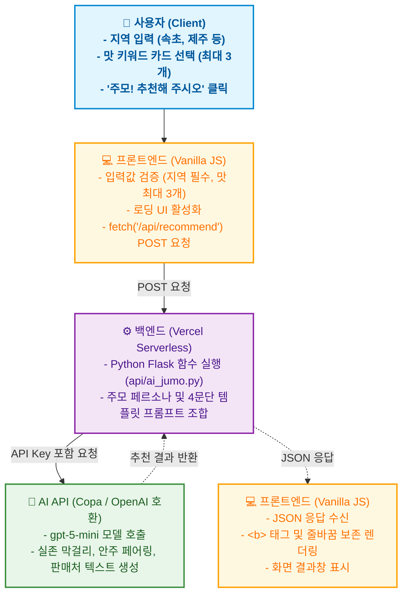

---

# 🍶 오늘 주막 (Today Jumak) - AI 막걸리 & 안주 추천 서비스

> OpenAI 호환 LLM API와 Vercel Serverless Functions를 활용한 AI 기반 맞춤형 막걸리 추천 웹 서비스입니다. 사용자가 원하는 지역과 맛(달달함, 산뜻함, 탄산 등)을 입력하고 이모지 카드로 선택하면, 친근한 AI 주모가 취향에 딱 맞는 실제 전통 막걸리와 찰떡궁합 안주, 그리고 판매처 정보를 추천해 줍니다.

---

## 📌 프로젝트 개요

사용자가 입력한 '지역'과 선택한 '맛' 키워드를 바탕으로 다음 정보를 실시간으로 제공합니다.

- **맞춤형 막걸리 추천**: 사용자의 취향과 지역을 반영한 최적의 실존 전통 막걸리 1종 확정 추천
- **상세 테이스팅 노트**: 첫맛, 탄산감, 목넘김, 피니시 등 구체적인 특징과 지역과의 어울림 설명
- **페어링 안주 1~2종 추천**: 해당 막걸리와 가장 잘 어울리는 안주 조합 제시 및 궁합 이유 설명
- **판매처 & 서울에서 구입여부 안내**: 서울 및 외지에서 구입 가능한지 여부 솔직 안내 및 시음 권유
- **직관적인 UI/UX**: 지역 입력 필드 및 최대 3개까지 복수 선택이 가능한 5가지 이모지 카드 인터페이스
- **실시간 제보 장부**: 사용자가 직접 나만의 막걸리 + 안주 조합을 남길 수 있는 방명록 기능

---

## 📚 프로젝트 학습 목표

이 프로젝트는 다음의 목표를 달성하기 위해 진행되었습니다.
- 프론트엔드(HTML/CSS/JS)와 백엔드(Python)의 역할을 분리하고 API(fetch)를 통한 통신 흐름 이해
- Vercel Serverless Functions를 활용한 빠르고 간편한 백엔드 배포 경험
- 환경 변수 설정을 통한 API 키 보안 및 안전한 관리 방법 습득
- LLM 프롬프트 엔지니어링을 통한 답변 페르소나 설정 및 일관된 출력 구조 제어
- AI 코딩 도구를 활용하되, 발생하는 에러(라우팅, CORS, 입력 검증 등)를 직접 디버깅하고 해결하는 문제 해결 능력 향상

---

## ✨ 주요 특징

- **AI 맞춤형 큐레이션 (주모 페르소나 & 4단계 추천 포맷)**
  - 단순한 랜덤 추천이 아닌, 사용자가 입력한 지역과 선택한 맛 키워드(🍯 달달함, 🍋 새콤함, ⚡ 톡 쏘는 탄산, 🌰 담백함, 🍦 크리미함)를 프롬프트로 조합합니다.
  - 사극 주모 톤(~했소, ~구려, ~추천하겠소)을 유지하며 일관된 4단계 문단 구조(인사 및 취향 확인 → 막걸리 추천 및 테이스팅 노트 → 어울리는 안주 2종 리스트 → 판매처 안내 및 마무리)로 답변을 생성합니다.
- **직관적이고 반응형인 웹 디자인**
  - 바닐라 HTML/CSS/JS로 구현되었으며, 모바일, 태블릿, 데스크톱 어디서든 자연스러운 반응형(Responsive) 카드 UI를 제공합니다.
- **HTML `<b>` 태그 기반 강조 및 줄바꿈 보존**
  - AI 프롬프트 자체에서 막걸리 및 안주 이름을 `<b>이름</b>` 태그로 감싸고 문단 간 빈 줄을 출력하도록 하여, 복잡한 클라이언트 측 정규식 처리 없이도 `innerHTML`과 CSS `white-space: pre-wrap;`을 통해 미려한 서식으로 렌더링됩니다.
- **Vercel Serverless 기반 백엔드**
  - 별도의 무거운 서버 구축 없이, Vercel의 Python Serverless Functions(`api/ai_jumo.py`)를 활용하여 빠르고 가볍게 AI API와 통신합니다.
- **견고한 에러 핸들링 및 UX 개선**
  - **지역 빈 입력 방지**: 지역을 입력하지 않고 버튼을 누르면 경고창(`alert`)을 띄워 입력을 유도합니다.
  - **맛 카드 선택 제한**: 맛 카드는 최대 3개까지만 고를 수 있도록 제한하여 프롬프트 명확성을 보장합니다.
  - **로딩 상태 표시**: AI 응답을 기다리는 동안 버튼 상태가 "주모가 막걸리 찾는 중... ⏳"으로 변경됩니다.
  - **API 오류 안내**: 통신 지연이나 에러 발생 시 사용자에게 친절한 안내 메시지("아이고, 주막에 불이 났소!")를 출력합니다.
- **보안성 강화**
  - API Key를 프론트엔드 코드에 노출하지 않고, Vercel 환경 변수(`OPENAI_API_KEY`)를 통해 안전하게 관리합니다.

---

## 🔄 전체 흐름도 (System Architecture)



---

## 📄 프로젝트 구조

```text
today-jumak/
├── index.html             ← 메인 웹 페이지 (UI, 반응형 맛 카드, 제보 장부, 통신 로직)
├── api/
│   ├── ai_jumo.py         ← Vercel Serverless 메인 엔드포인트 및 AI 추천 로직
│   └── index.py           ← 로컬 및 대체 Serverless 엔드포인트
├── requirements.txt       ← 백엔드(Python) 실행에 필요한 패키지 목록 (Flask, requests 등)
├── vercel.json            ← Vercel 빌드 및 라우팅 설정 파일
├── .env                   ← 로컬 테스트용 API 키 (Git 업로드 제외)
├── .gitignore             ← Git 업로드 제외 목록
└── README.md              ← 프로젝트 설명 문서
```

---

## 🛠 기술 스택 (Tech Stack)

- **Frontend**: HTML5, CSS3, JavaScript (Vanilla)
- **Backend**: Python (Flask, Vercel Serverless Functions)
- **AI**: OpenAI 호환 LLM API (`gpt-5-mini` / Copa Proxy Server)
- **Deployment**: Vercel, GitHub

---

## ⚙️ 로컬 실행 및 배포 방법

### 1. 로컬 환경 테스트
```bash
# 1. 저장소 클론
git clone <저장소_URL>
cd today-jumak

# 2. Vercel CLI 설치 (Node.js 필요)
npm i -g vercel

# 3. 환경변수 설정
# 최상위 폴더에 .env 파일을 만들고 아래 내용을 입력합니다.
OPENAI_API_KEY=sk-xxxxxxxxxxxxxxxx

# 4. 로컬 서버 실행
vercel dev
```
> `vercel dev` 명령어를 사용하면 로컬에서도 `api/` 폴더의 Python 함수를 정상적으로 테스트할 수 있습니다.

### 2. Vercel 배포 (Deployment)
1. GitHub에 코드를 Push 합니다.
2. Vercel 대시보드에서 `Add New Project`를 클릭하고 해당 GitHub 저장소를 연결합니다.
3. **Environment Variables** 설정 창에서 `OPENAI_API_KEY`를 등록합니다.
4. `Deploy` 버튼을 누르면 전 세계에서 접속 가능한 URL이 생성됩니다.

---

## 🔑 환경 변수 관리 (보안)

- **OPENAI_API_KEY**: OpenAI 플랫폼 또는 교육용 서버에서 발급받은 시크릿 키.
- ⚠️ **주의**: `.env` 파일은 `.gitignore`에 포함하여 절대 GitHub에 올라가지 않도록 처리했습니다. 배포 시에는 Vercel 대시보드의 환경 변수 설정 기능을 사용합니다.

---

## 🔍 트러블슈팅 및 개선 사항

1. **사용자 입력 예외 처리**
   - 지역을 입력하지 않고 추천 버튼을 누를 경우, JS에서 이를 감지하고 `alert("어느 지역의 막걸리를 찾으시는지 알려주시오!")`를 띄워 불필요한 API 호출을 방지합니다.
   - 맛 선택 카드는 최대 3개까지만 고를 수 있도록 제한(`alert("아이고 손님! 맛은 최대 3개까지만 고를 수 있소!")`)하여 취향의 명확성을 확보합니다.
2. **API 통신 지연 및 실패**
   - 네트워크 문제나 API 할당량 초과 시, 무한 로딩에 빠지지 않도록 `catch` 블록을 통해 "아이고, 주막에 불이 났소!"라는 에러 메시지를 UI에 표시하고 버튼을 원래대로 복구합니다.
3. **텍스트 포맷팅 및 가독성 개선**
   - AI 프롬프트에 `<b>` 태그 규칙과 4개 문단 분리 규칙을 명시하고, 프론트엔드의 `white-space: pre-wrap;` 스타일을 조합하여 정규식 치환 없이도 막걸리와 안주 이름을 굵은 글씨로 강조하고 줄바꿈을 완벽히 유지하도록 개선했습니다.
4. **이모지 시각적 가독성 개선**
   - 다섯 번째 맛 카드(걸쭉하고 크리미한 맛)의 이모지를 플랫폼에 따라 흑백으로 보일 수 있는 🥛 대신, 풍성한 색감을 가진 🍦(소프트아이스크림)으로 변경하여 직관적인 비주얼을 제공합니다.

---

## 🚀 향후 개선 아이디어

- **제보 장부 DB 연동**: 현재는 화면에만 임시로 추가되는 제보 장부를 Firebase나 Supabase 같은 가벼운 DB와 연동하여 영구적으로 저장되도록 개선.
- **결과 공유 기능**: 추천받은 막걸리 조합을 카카오톡이나 인스타그램으로 바로 공유할 수 있는 버튼 추가.
- **다크 모드 지원**: 밤에 술을 찾는 사용자들을 위해 눈이 편안한 다크 모드 UI 토글 기능 추가.
- **지도에서 지역 선택 기능**: 지역을 직접 입력하지 않고, 지도에서 지역을 바로 선택할 수 있는 기능 추가.

---

## 🌐 배포 URL
- **라이브 서비스 접속하기**: [https://today-jumak.vercel.app](https://today-jumak.vercel.app)

---
