---

# 🍶 오늘 주막 (Today Jumak) - AI 막걸리 & 안주 추천 서비스

> OpenAI API와 Vercel Serverless Functions를 활용한 AI 기반 맞춤형 막걸리 추천 웹 서비스입니다. 사용자가 원하는 맛(단맛, 신맛 등)을 이모지 카드로 선택하면, AI가 취향에 딱 맞는 막걸리와 찰떡궁합 안주를 추천해 줍니다.

---

## 📌 프로젝트 개요

사용자가 선택한 '맛' 키워드를 바탕으로 다음 정보를 실시간으로 제공합니다.

- **맞춤형 막걸리 추천**: 사용자의 취향을 반영한 최적의 막걸리 1종 추천
- **페어링 안주 추천**: 해당 막걸리와 가장 잘 어울리는 안주 조합 제시
- **직관적인 UI/UX**: 최대 3개까지 복수 선택이 가능한 이모지 카드형 맛 선택 인터페이스
- **실시간 제보 장부**: 사용자가 직접 나만의 막걸리 조합을 남길 수 있는 방명록 기능

---

## 📚 프로젝트 학습 목표

이 프로젝트는 다음의 목표를 달성하기 위해 진행되었습니다.
- 프론트엔드(HTML/CSS/JS)와 백엔드(Python)의 역할을 분리하고 API(fetch)를 통한 통신 흐름 이해
- Vercel Serverless Functions를 활용한 빠르고 간편한 백엔드 배포 경험
- 환경 변수 설정을 통한 API 키 보안 및 안전한 관리 방법 습득
- AI 코딩 도구를 활용하되, 발생하는 에러(CORS, 파싱 에러 등)를 직접 디버깅하고 해결하는 문제 해결 능력 향상

---

## ✨ 주요 특징

- **AI 맞춤형 큐레이션 (OpenAI API)**
  - 단순한 랜덤 추천이 아닌, 사용자가 선택한 키워드(예: 🍓단맛, 🍋신맛, 톡 쏘는 탄산 등)를 프롬프트로 조합하여 AI가 논리적인 추천 결과를 생성합니다.
- **직관적이고 반응형인 웹 디자인**
  - 바닐라 HTML/CSS/JS로 구현되었으며, 모바일, 태블릿, 데스크톱 어디서든 깨지지 않는 반응형(Responsive) UI를 제공합니다.
- **Vercel Serverless 기반 백엔드**
  - 별도의 무거운 서버 구축 없이, Vercel의 Python Serverless Functions(`api/`)를 활용하여 빠르고 가볍게 AI API와 통신합니다.
- **견고한 에러 핸들링 및 UX 개선**
  - **빈 입력 방지**: 맛을 선택하지 않고 버튼을 누르면 경고창(Alert)을 띄웁니다.
  - **로딩 상태 표시**: AI 응답을 기다리는 동안 버튼 상태가 변경되며 로딩 메시지를 제공합니다.
  - **API 오류 안내**: 통신 지연이나 에러 발생 시 사용자에게 친절한 안내 메시지를 출력합니다.
- **보안성 강화**
  - OpenAI API Key를 프론트엔드 코드에 노출하지 않고, Vercel의 환경 변수(Environment Variables)를 통해 안전하게 관리합니다.

---

## 🔄 전체 흐름도 (System Architecture)

```mermaid
flowchart TD
    classDef userNode fill:#E1F5FE,stroke:#0288D1,stroke-width:2px,color:#01579B,font-weight:bold
    classDef frontNode fill:#FFF8E1,stroke:#FFA000,stroke-width:2px,color:#FF6F00
    classDef backNode fill:#F3E5F5,stroke:#8E24AA,stroke-width:2px,color:#4A148C
    classDef aiNode fill:#E8F5E9,stroke:#388E3C,stroke-width:2px,color:#1B5E20

    A["👤 사용자 (Client)<br/>- 맛 키워드 선택 (최대 3개)<br/>- '추천받기' 클릭"]
    B["💻 프론트엔드 (Vanilla JS)<br/>- 입력값 검증<br/>- 로딩 UI 활성화<br/>- fetch('/api/...') 요청"]
    C["⚙️ 백엔드 (Vercel Serverless)<br/>- Python 함수 실행<br/>- 프롬프트 조합"]
    D["🤖 OpenAI API<br/>- gpt-3.5 / 4o-mini<br/>- 추천 결과 텍스트 생성"]
    E["💻 프론트엔드 (Vanilla JS)<br/>- JSON 응답 파싱<br/>- 막걸리/안주명 굵은 글씨 처리<br/>- 화면에 결과 렌더링"]

    class A userNode
    class B,E frontNode
    class C backNode
    class D aiNode

    A --> B
    B -->|POST 요청| C
    C -->|API Key 포함 요청| D
    D -.->|추천 결과 반환| C
    C -.->|JSON 응답| E
```



---

## 📄 프로젝트 구조

```text
today-jumak/
├── index.html             ← 메인 웹 페이지 (UI 및 프론트엔드 로직 포함)
├── api/
│   ├── ai_jumo.py         ← AI 프롬프트 및 추천 로직
│   └── index.py           ← Vercel Serverless 엔드포인트
├── requirements.txt       ← 백엔드(Python) 실행에 필요한 패키지 목록
├── vercel.json            ← Vercel 배포 설정 파일
├── .env                   ← 로컬 테스트용 API 키 (Git 업로드 제외)
├── .gitignore             ← Git 업로드 제외 목록
└── README.md              ← 프로젝트 설명 문서
```

---

## 🛠 기술 스택 (Tech Stack)

- **Frontend**: HTML5, CSS3, JavaScript (Vanilla)
- **Backend**: Python (Vercel Serverless Functions)
- **AI**: OpenAI API (gpt-3.5-turbo / gpt-4o-mini)
- **Deployment**: Vercel, GitHub

---

## ⚙️ 로컬 실행 및 배포 방법

### 1. 로컬 환경 테스트
```bash
# 1. 저장소 클론
git clone <저장소_URL>
cd today-jumak

# 2. Vercel CLI 설치 (Node.js 필요)
npm i -g vercel

# 3. 환경변수 설정
# 최상위 폴더에 .env 파일을 만들고 아래 내용을 입력합니다.
OPENAI_API_KEY=sk-xxxxxxxxxxxxxxxx

# 4. 로컬 서버 실행
vercel dev
```
> `vercel dev` 명령어를 사용하면 로컬에서도 `api/` 폴더의 Python 함수를 정상적으로 테스트할 수 있습니다.

### 2. Vercel 배포 (Deployment)
1. GitHub에 코드를 Push 합니다.
2. Vercel 대시보드에서 `Add New Project`를 클릭하고 해당 GitHub 저장소를 연결합니다.
3. **Environment Variables** 설정 창에서 `OPENAI_API_KEY`를 등록합니다.
4. `Deploy` 버튼을 누르면 전 세계에서 접속 가능한 URL이 생성됩니다.

---

## 🔑 환경 변수 관리 (보안)

- **OPENAI_API_KEY**: OpenAI 플랫폼에서 발급받은 시크릿 키.
- ⚠️ **주의**: `.env` 파일은 `.gitignore`에 포함하여 절대 GitHub에 올라가지 않도록 처리했습니다. 배포 시에는 Vercel 대시보드의 환경 변수 설정 기능을 사용합니다.

---

## 🔍 트러블슈팅 및 에러 처리

1. **사용자 입력 예외 처리**
   - 맛을 하나도 선택하지 않고 추천 버튼을 누를 경우, JS에서 이를 감지하고 `alert("최소 1개 이상의 맛을 선택해주세요!")`를 띄워 불필요한 API 호출을 방지합니다.
2. **API 통신 지연 및 실패**
   - 네트워크 문제나 API 할당량 초과(429 Error) 시, 무한 로딩에 빠지지 않도록 `catch` 문을 통해 "서버와 연결이 원활하지 않습니다. 잠시 후 다시 시도해주세요."라는 에러 메시지를 UI에 표시합니다.
3. **텍스트 포맷팅 (정규식 활용)**
   - AI가 반환한 텍스트 중 막걸리 이름과 안주 이름을 시각적으로 강조하기 위해, JS에서 `innerHTML`과 정규식을 활용하여 특정 키워드를 **굵은 글씨(Bold)**로 변환하여 렌더링합니다.

---

## 🚀 향후 개선 아이디어

- **제보 장부 DB 연동**: 현재는 화면에만 임시로 추가되는 제보 장부를 Firebase나 Supabase 같은 가벼운 DB와 연동하여 영구적으로 저장되도록 개선.
- **결과 공유 기능**: 추천받은 막걸리 조합을 카카오톡이나 인스타그램으로 바로 공유할 수 있는 버튼 추가.
- **다크 모드 지원**: 밤에 술을 찾는 사용자들을 위해 눈이 편안한 다크 모드 UI 토글 기능 추가.
- **지도에서 지역 선택 기능**: 지역을 직접 입력하지 않고, 지도에서 지역을 바로 선택할 수 있는 기능 추가. 


---

## 🌐 배포 URL
- **라이브 서비스 접속하기**: [여기에 Vercel에서 발급받은 URL을 적어주세요! 예: https://today-jumak.vercel.app]

---
