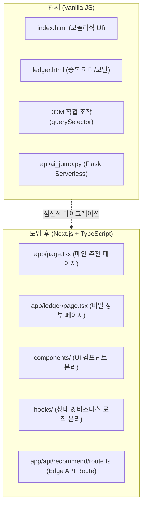

# 🔄 프론트엔드 아키텍처 분석 및 프레임워크 마이그레이션 계획

> **문서 버전**: v1.0  
> **최종 수정일**: 2026-09-22  
> **프로젝트**: 오늘 주막 (`today-jumak`)  
> **대상 프레임워크**: React (Next.js App Router) / TypeScript

---

## 1. 개요 및 현재 아키텍처 분석

현재 `today-jumak` 서비스는 별도의 빌드 도구 없이 브라우저에서 직접 실행되는 **Vanilla JavaScript (ES Modules), HTML5, CSS3**를 기반으로 구축되었습니다.

### 1.1 현재 아키텍처 (Vanilla JS) 선정 배경 및 장점
- **제로 빌드 오버헤드**: Webpack, Vite, Babel 등의 번들러 설정 없이 파일 수정 즉시 브라우저에서 확인 가능.
- **초경량 번들**: 외부 프레임워크 런타임(React ~40KB 등)이 없어 초기 로딩 속도(FCP, LCP)가 극도로 빠름.
- **학습 곡선 최소화**: 웹 표준 기술만으로 동작 흐름과 API 연동 구조를 직관적으로 파악 가능.

### 1.2 규모 확장에 따른 한계점 (Pain Points)
1. **명령형 DOM 조작의 한계**: 상태(State)가 변경될 때마다 `innerHTML`, `style.display`, `classList.toggle` 등을 직접 제어해야 하므로 UI 동기화 버그 발생 위험 증가.
2. **컴포넌트 재사용성 결여**: `index.html`과 `ledger.html` 간의 헤더 네비게이션, 커스텀 모달(`openJumakModal`), 로딩 인디케이터 등의 코드가 파일별로 중복 작성됨.
3. **타입 안전성 부재**: JavaScript 특성상 API 응답 객체 및 Firestore 문서 스키마의 타입 검증이 런타임에만 이루어짐.
4. **글로벌 스코프 오염 위험**: 모듈 스크립트를 사용하더라도 전역 이벤트 리스너와 윈도우 객체 참조 관리가 까다로움.

---

## 2. 모던 프레임워크 도입 분석 (React / Next.js / Vue.js)

### 2.1 프레임워크 비교 평가

| 평가 기준 | 바닐라 JS (현재) | React (Vite + SPA) | Next.js (App Router) ⭐ **권장** | Vue.js (Nuxt 3) |
| :--- | :--- | :--- | :--- | :--- |
| **초기 로딩 속도** | ⚡ 최상 (번들 없음) | 🟢 보통 (SPA 번들 다운로드) | ⚡ 최상 (SSR/SSG 사전 렌더링) | 🟢 우수 (하이브리드 렌더링) |
| **SEO 및 공유 최적화** | 🟡 기본 (정적 메타태그) | 🔴 미흡 (CSR로 크롤링 한계) | 🟢 완벽 (동적 OGP/메타태그) | 🟢 완벽 (SEO 모듈 내장) |
| **컴포넌트 재사용성** | 🔴 낮음 (HTML 복사) | 🟢 높음 (JSX/TSX 컴포넌트) | 🟢 최상 (서버/클라이언트 컴포넌트) | 🟢 높음 (SFC 구조) |
| **상태 관리 용이성** | 🔴 명령형 (직접 조작) | 🟢 선언적 (Hook, Zustand) | 🟢 선언적 (Server Actions, Zustand) | 🟢 선언적 (Pinia) |
| **Vercel 호환성** | 🟢 양호 (정적 호스팅) | 🟢 양호 | ⚡ 최적 (Vercel 네이티브 최적화) | 🟢 양호 |
| **학습 및 전환 비용** | - | 🟡 중간 | 🔴 다소 높음 | 🟡 중간 |

> **최종 권장안**: **Next.js (TypeScript + Tailwind CSS)**  
> Vercel과의 완벽한 네이티브 통합, 추천 결과 공유를 위한 동적 Open Graph(OGP) 생성, 그리고 향후 관리자 대시보드 확장을 고려할 때 가장 높은 생산성과 완성도를 제공합니다.

---

## 3. 프레임워크 도입 시 변경 범위 (Scope of Changes)



### 3.1 디렉토리 및 컴포넌트 구조 개편
```text
today-jumak-v2/
├── src/
│   ├── app/
│   │   ├── layout.tsx              # 전역 레이아웃 및 폰트 설정
│   │   ├── page.tsx                # 메인 추천 페이지 (기존 index.html)
│   │   ├── ledger/
│   │   │   └── page.tsx            # 주모의 비밀 장부 페이지 (기존 ledger.html)
│   │   └── api/
│   │       └── recommend/route.ts  # Next.js Serverless API Route (Edge Runtime)
│   ├── components/
│   │   ├── common/
│   │   │   ├── Header.tsx          # 공통 상단 네비게이션
│   │   │   ├── Modal.tsx           # 주막 테마 모달 (포털 기반)
│   │   │   └── Footer.tsx          # 공통 푸터
│   │   ├── recommendation/
│   │   │   ├── RegionInput.tsx     # 지역 입력 컴포넌트
│   │   │   ├── TasteSelector.tsx   # 5종 맛 카드 다중 선택기
│   │   │   └── ResultCard.tsx      # 주모 추천 결과 뷰어
│   │   └── ledger/
│   │       ├── ReportForm.tsx      # 인생 막걸리 제보 폼
│   │       └── LedgerTable.tsx     # 실시간 한 줄 제보 테이블
│   ├── hooks/
│   │   ├── useRecommendation.ts    # AI 추천 요청 및 상태 관리 훅
│   │   ├── useFirestoreReports.ts  # Firebase 실시간 구독(onSnapshot) 훅
│   │   └── useModal.ts             # 모달 열기/닫기 제어 훅
│   ├── types/
│   │   └── index.ts                # Taste, Report, RecommendResponse 타입 정의
│   └── styles/
│       └── globals.css             # Tailwind CSS 설정
└── package.json
```

### 3.2 상태 관리 아키텍처
- **맛 선택 상태**: `selectedTastes: TasteType[]` (최대 3개 제한 로직을 커스텀 훅 `useTasteSelector`로 캡슐화).
- **모달 상태**: React `createPortal` 기반으로 DOM 최상단에 마운트하여 z-index 충돌 및 레이아웃 깨짐 방지.
- **데이터 페칭**: React Query (`@tanstack/react-query`) 또는 SWR을 도입하여 동일 취향 추천에 대한 클라이언트 캐싱 구현.

---

## 4. 4단계 점진적 마이그레이션 계획 (Phased Migration Plan)

| 단계 | 목표 | 주요 작업 내용 | 소요 기간 (예상) |
| :---: | :--- | :--- | :---: |
| **Phase 1<br/>(기반 구축)** | 프로젝트 셋업 & 개발 환경 구성 | • `create-next-app` (TypeScript, Tailwind CSS, ESLint)<br>• Vercel 프로젝트 신규 연결 및 환경 변수 동기화<br>• 기본 레이아웃 및 폰트(전통 한글 서체) 세팅 | 1일 |
| **Phase 2<br/>(UI 컴포넌트화)** | 정적 UI 컴포넌트 분리 및 이식 | • 5종 맛 카드 컴포넌트 (`TasteSelector`) 제작<br>• 주막 전용 커스텀 모달 포털 컴포넌트 제작<br>• 반응형 그리드 및 한 줄 테이블 레이아웃 구현 | 2일 |
| **Phase 3<br/>(로직 & API 결합)** | 상태 관리 및 백엔드/DB 연동 | • Firebase Web SDK v10 모듈화 및 커스텀 훅 작성<br>• `POST /api/recommend` 핸들러 이식 (Edge 런타임 적용)<br>• 2.5초 타임아웃 및 낙관적 UI(Optimistic Update) 적용 | 2일 |
| **Phase 4<br/>(테스트 & 전환)** | 품질 검증 및 프로덕션 컷오버 | • Lighthouse 성능(LCP, CLS, FID) 및 접근성 측정<br>• 모바일 브라우저 크로스 브라우징 테스트<br>• 도메인 DNS 전환 및 구 버전 리다이렉트 처리 | 1일 |

---

## 5. 비용 및 리스크 분석

1. **빌드 시간 및 호스팅 비용**:
   - Vercel Hobby 티어 내에서 Next.js 빌드 시간(평균 30~45초)은 충분히 무상 범위 내에 수용 가능.
2. **의존성 관리 리스크**:
   - 패키지 업데이트로 인한 호환성 문제를 방지하기 위해 `package-lock.json`을 엄격히 관리하고 Dependabot 설정.
3. **롤백 계획 (Rollback Plan)**:
   - 마이그레이션 기간 동안 기존 Vanilla JS 코드는 `legacy-vanilla` 브랜치에 보존하며, 이슈 발생 시 Vercel에서 원클릭으로 이전 커밋 즉시 롤백 가능.
